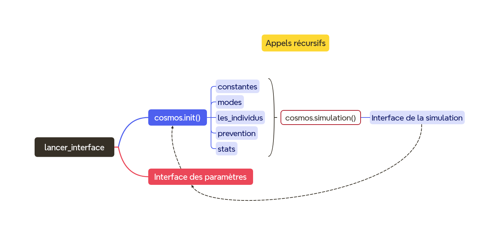

# Documentation du projet Epydemie

## Carte mentale pour comprendre le lien qu'ont les fichiers entre eux et comment ils fonctionnent



## Description fonctionnelle du projet par rapport au cahier des charges

Actions possibles de l'utilisateur dans les paramètres selon le cahier des charges :

- Choisir la taille de la population et le nombre de personnes
initialement infectées.
- Choisir la valeur du taux d’infectiosité.
- Choisir la durée de l’infection.
- Choisir à quel moment commence la quarantaine après le début de
l’épidémie.
- Choisir après combien de jours d’infections la quarantaine est mise
en place.
- Choisir le facteur de la distance sociale et la probabilité que tout le monde la respecte.
- Choisir le type de carte et d'environnement pour la population.

Toutes ces actions n'ont pas pu être réalisées, ou au moins partiellement. Une explication claire sur les abandons
de certaines possibilités est fournie dans le bilan critique.

Quoi qu'il en soit, les actions possibles au final sont décrites dans le dictionnaire parametres_de_base de lancer_interface.py :

```
# Définition des paramètres par défaut en attendant une modification
# Via l'interface utilisateur
parametres_de_base = {
        "NB_INDIVIDUS": 135,  # Nombre total d'individus dans la simulation
        "VITESSE_MAX": 0.35,  # Vitesse maximale des individus. Influence la propagation.
        "TAUX_INFECTIOSITE": 0.5,  # La probabilité d'être infecté. Entre 0 et 1.
        "TAUX_ASYMPTOMATIQUES": 0.55,  # La probabilité d'être asymptomatique et jamais envoyé en quarantaine. Entre 0 et 1.
        "LETALITE": 0.2,  # Chances de mourir du virus
        "LA_QUARANTAINE": True,  # Quarantaine ou pas
        "RAYON_DISTANCIATION": False,  # Distanciation sociale ou pas (difficile de le faire modulable)
        "TAUX_DISSIDENTS": 0.2,  # La probabilité d'être un individu qui n'écoute pas les consignes de distanciation
        # Modes de simulation
        "VILLE_CENTRALE": False,  # Activer le mode "Ville centrale"
        "COMMUNAUTES": False,  # Activer le mode "Communautés"
        "PROBABILITE_VOYAGE_VERS_VILLE": 0.5,  # Probabilité de voyage vers la ville
        # Doit être très basse car les tours de boucle s'enchaînent très vite --> 10**-2
        "PROBABILITE_VOYAGE_VERS_COMMUNAUTE": 0.6,  # Probabilité de voyage vers une autre communauté
        # Doit être très basse car les tours de boucle s'enchaînent très vite --> 10**-3
        }
```

---

Actions de l'ordinateur selon le cahier des charges :

- Faire des calculs en fonction des paramètres choisis par l’utilisateur.
- Faire une modélisation reposant sur les paramètres sélectionnés par l’utilisateur.

 Pour la suite de cette documentation, l'équipe a décidé que fournir le nom de chaque fonction et fichiers qui les contiennent pour chaque
 variable des paramètres ne serait pas utile et n'aiderait nullement le lecteur. Ceci serait long, fastidieux et n'aurait pas d'interêt dans
 l'idée de renseigner autrui sur le fonctionnement du programme.

 La fonction centrale de notre programme est la fonction **cosmos.simulation()**. Tout s'articule autour d'elle et de ses appels récursifs.
 Le plus logique et le plus efficace pour comprendre le programme est donc d'en expliquer son fonctionnement.
 En détaillant le code de **cosmos.simulation()**, on détaille en fait tout le programme.

 Le contenu de cette fonction est dans une boucle while non bornée avec comme condition le fait que l'utilisateur n'ait pas
 ouvert les paramètres en vue de les modifier pour une nouvelle simulation.
Ainsi, à chaque tour, on vérifie avec MOUSEBUTTONDOWN de pygame que il n'y a pas eu de clic sur l'icône des paramètres et que la
simulation peut continuer tranquillement en conséquence.
Si il y a eu un clic, on lance run() de la classe Parametres de lancer_interface.py.

Ensuite, on s'attelle au dessin de l'interface de la simulation qui permet à l'utilisateur de comprendre visuellement
la propagation de l'épidémie, c'est là que on transforme les calculs de la machine en objets de couleurs 2D.
On utilise fill() pour remplir, blit() pour les images et le texte et rect() pour les cadres. Ces fonctions proviennent de pygame.

Il ne reste plus que à dessiner l'essentiel : les points qui représentent les individus.

Avant de faire cela, on fait un traitement afin d'actualiser le statut de chaque individu, aussi bien spatial que temporel (d'où le nom de cosmos).
On filtre les morts avec l'attribut booléen vie de la classe Individu.
On applique la distanciation sociale si besoin avec la méthode appliquer_distanciation(autres_individus) de Individu. Cette méthode
utilise la bibliothèque math.
On fait ce que nous nommons la routine, c'est-à-dire un ensemble d'opérations nécessaires à la simulation sur chaque individu et à chaque tour de boucle :
- Vérifications sur le statut de mort ou guéri
- Placements en quarantaine
- Gestion de la quarantaine
    - Utilisation de choisir_communaute() de la classe Communautes qui fait appel à l'attribut communautes de Cosmos
    qui fait appel à initialiser_communautes() de Communautes qui fait appel à l'attribut nb_communautes_x et nb_communautes_y de Cosmos
    qui valent respectivement 3 selon les constantes de bases du programme.
- Mouvements
    - Vérifie que il n'y a pas de voyage en ville ou de changement de communauté à faire puis incrémente les positions x et y de l'individu avec sa vitesse
    qui lui est propre (définie aléatoirement avec la vitesse maximale des paramètres).
- Rebonds
    - Calculs mathématiques adaptés à l'environnement (cadre principale, communauté, quarantaine).
- Dessins de points

Ensuite, il y a un bloc dedié à la gestion des collisions entre les points. Nous avons décidé de modéliser une infection par une collision
entre un non infecté (bleu ou vert) et un infecté (rouge). C'est une partie vitale de la simulation.
On commence par actualiser la liste de tuples d'objets de la classe Individu en collision. On utilise la méthode detecter_collision() de la classe
Individu pour cela.
Naturellement, on continue en testant si il y a de nouvelles collisions. Si oui et que un nombre tiré au hasard entre 0 et 1 avec la bibliothèque
random est en-dessos d'une probabilité d'infection définie par l'utilisateur en paramètres alors on infecte (le non infecté devient rouge).
L'utilité de tenir le compte des collisions en cours et donc déjà comptabilisées est que le programme comptait plusieurs fois la même collision avant.

Pour finir on actualise les statistiques en temps réel de la simulation avec la classe Stats et ses méthodes au nom explicite :
- afficher_statistiques
- actualiser_courbes
- afficher_courbes

Le tour de boucle prend fin avec une mise à jour complète des modifications effectuées avec pygame.display.flip().


